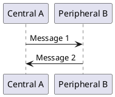

# Sources Directory

This directory contains source files for diagrams and visualizations that are compiled into figures for the BlueFort ACM 2025 research paper.

## 📁 Contents

### PlantUML Diagrams

- **`lsc.puml`** - PlantUML source for LSC protocol sequence diagram
  - Compiles to: `../figures/lsc.png`
  - Purpose: Defines the Bluetooth LSC protocol flow
  - Usage: Edit this file to modify the protocol diagram

## 🚀 Usage

### PlantUML Compilation

#### Using PlantUML Extension (VS Code)
1. Install PlantUML extension in VS Code
2. Open `.puml` file
3. Use `Alt+Shift+D` to preview
4. Use `Alt+Shift+P` to export to PNG

#### Using Command Line
```bash
# Install PlantUML
sudo apt-get install plantuml

# Compile diagram
plantuml lsc.puml

# Output will be saved as lsc.png
```

#### Using Python with plantuml package
```bash
# Activate virtual environment
source ../venv/bin/activate

# Compile using Python
python -c "import plantuml; plantuml.PlantUML().processs_file('lsc.puml')"
```

## 📝 PlantUML Syntax

### Basic Sequence Diagram


### Styling Options

```plantuml
@startuml
!theme plain
skinparam backgroundColor white
skinparam sequenceArrowThickness 2
skinparam participantFontSize 12

participant A as "Central A"
participant B as "Peripheral B"
@enduml
```


## 🔧 Adding New Sources

### PlantUML Diagrams
1. **Create new `.puml` file** in this directory
2. **Use descriptive filename** (e.g., `protocol_flow.puml`)
3. **Include proper PlantUML syntax** with @startuml/@enduml
4. **Add comments** explaining the diagram purpose
5. **Update this README** with file description

### Other Source Types
- **SVG source files** for vector graphics
- **TikZ source files** for LaTeX graphics
- **DOT files** for Graphviz diagrams
- **Mermaid files** for flowcharts

## 📊 Source File Guidelines

### Naming Conventions
- Use lowercase with underscores
- Include file type in name (e.g., `lsc_protocol.puml`)
- Use descriptive names that indicate content

### Documentation
- **Header comments** explaining the diagram purpose
- **Version information** and last modified date
- **Author information** for attribution
- **Usage instructions** for compilation

### Version Control
- ✅ **Track source files** in this directory
- ✅ **Include compilation instructions** in README
- ✅ **Document dependencies** and tools required
- ✅ **Use consistent formatting** across source files

## 🛠️ Tools and Dependencies

### Required Tools
- **PlantUML**: For sequence diagrams and flowcharts
- **Java**: Required by PlantUML
- **Graphviz**: For some PlantUML diagram types

### Installation
```bash
# Install PlantUML and dependencies
sudo apt-get install plantuml graphviz

# Or install via Python
pip install plantuml
```

### VS Code Extensions
- **PlantUML**: For preview and export
- **Markdown Preview Enhanced**: For embedded diagrams
- **Draw.io Integration**: For additional diagram types

## 📋 Workflow

### Development Workflow
1. **Edit source file** (e.g., `lsc.puml`)
2. **Preview changes** using PlantUML extension
3. **Compile to PNG** for final output
4. **Move to figures directory** if needed
5. **Update documentation** if diagram changes

### Integration with LaTeX
1. **Compile source** to PNG format
2. **Place in figures directory**
3. **Include in LaTeX** using `\includegraphics`
4. **Reference in text** using `\ref{fig:label}`

## 🎯 Best Practices

### Diagram Design
1. **Keep it simple** - avoid unnecessary complexity
2. **Use consistent styling** across all diagrams
3. **Include proper labels** and descriptions
4. **Ensure readability** at publication size
5. **Follow ACM guidelines** for figure quality

### Source Management
1. **Version control** all source files
2. **Document dependencies** and tools
3. **Use consistent naming** conventions
4. **Include compilation instructions**
5. **Maintain backup** of source files

### Quality Assurance
1. **Test compilation** before committing
2. **Verify output quality** meets ACM standards
3. **Check file sizes** are reasonable
4. **Ensure accessibility** for colorblind readers
5. **Validate against** publication requirements 